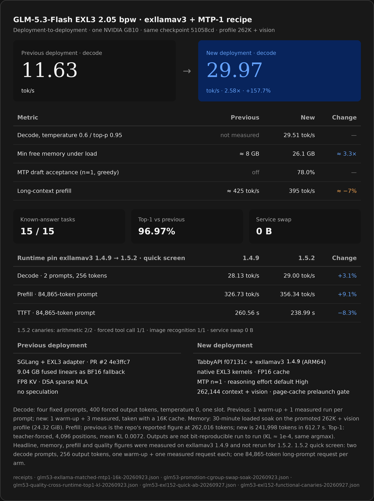

# GLM-5.3 Flash EXL3 on one NVIDIA GB10

A pinned recipe for serving GLM-5.3 Flash EXL3 2.05 bpw with exllamav3 1.5.2 and MTP n=1 behind TabbyAPI on one NVIDIA GB10, at 262,144 tokens of configured context with vision enabled. The 1.4.9 image remains available for rollback. The full-suite historical card and the narrower 1.5.2 quick screen are separate evidence cohorts.



## Historical full-suite result (exllamav3 1.4.9)

Deployment to deployment on the same checkpoint (`51058cd`). The previous lane was SGLang with an EXL3 adapter; the measured replacement was TabbyAPI on **exllamav3 1.4.9**. The large figures on the card were not rerun on 1.5.2.

| Metric | Previous deployment | New deployment | Change |
|---|---:|---:|---:|
| Decode | 11.63 tok/s | **29.97 tok/s** | **2.58x, +157.7%** |
| Decode, temperature 0.6 / top-p 0.95 | not measured | 29.51 tok/s | — |
| Min free memory under load | ≈ 8 GB | **26.1 GB** | ≈ 3.3x |
| MTP draft acceptance (n=1, greedy) | off | 78.0% | — |
| Long-context prefill | ≈ 425 tok/s | 395 tok/s | ≈ −7% |
| Known-answer tasks | — | 15 / 15 | — |
| Top-1 agreement vs previous | — | 96.97% | — |
| Service swap during a 30-minute loaded soak | — | 0 B | — |

What the new lane changes:

- TabbyAPI `f07131c` with exllamav3 1.4.9 (ARM64, local patch)
- native EXL3 kernels and an FP16 cache
- MTP n=1, with reasoning effort defaulting to High
- 262,144-token context with vision
- a page-cache prelaunch gate

The previous lane ran SGLang with the EXL3 adapter (`PR #2`, `4e3ffc7`), 9.04 GB of fused linears held as a BF16 fallback, FP8 KV, DSA sparse MLA, and no speculation.

## exllamav3 1.5.2 quick screen

Same checkpoint, TabbyAPI commit, FP16 cache, MTP n=1, 262,144-token configured capacity with vision enabled, and one GB10. The engine changed from 1.4.9 to 1.5.2. A third arm ran 1.5.2 with legacy-like KDA flags to distinguish a bundled KDA-path effect; it is in the [receipt](exllamav3/results/glm53-exl152-quick-ab-20260927.json), not the headline comparison.

| Matched quick-screen metric | 1.4.9 | 1.5.2 default | Change |
|---|---:|---:|---:|
| Decode, mean of prose and code | 28.13 tok/s | **29.00 tok/s** | **+3.1%** |
| Prefill, 84,865-token prompt | 326.73 tok/s | **356.34 tok/s** | **+9.1%** |
| Time to first token, same prompt | 260.56 s | **238.99 s** | **−8.3%** |

Decode used 256 output tokens, temperature 0, one warm-up and **one measured request per case**. The long prompt was run once per arm, with 24 output tokens. These are quick-screen observations, not confidence intervals or results at the full 262K prompt depth. The candidate passed two arithmetic canaries, one forced tool call and one image-recognition canary. Service cgroup swap was zero in the observed loads and requests. Output hashes differed; the 15-task panel, cross-runtime top-1 test and 30-minute soak shown in the historical card **were not repeated** for 1.5.2. Do not compare its 29.00 tok/s to the historical 29.97 tok/s: those used different prompts and output lengths.

## Measurement contract

- The following is the historical 1.4.9 versus SGLang contract, **not** the 1.5.2 quick-screen contract above. Hardware: one NVIDIA GB10.
- Decode: four fixed prompts, 400 forced output tokens, temperature 0, one slot. Previous: one warm-up plus one measured run per prompt. New: one warm-up plus three measured runs, taken with a 16K cache.
- Memory: a 30-minute loaded soak on the promoted 262K + vision profile, one live generation per minute. Minimum `MemAvailable` 24.32 GiB.
- Prefill: previous is the retired lane's reported figure at 262,016 tokens; new is 241,998 tokens in 612.7 s.
- Top-1: teacher-forced, 4,096 scored positions across four workloads, mean KL 0.0072.
- Determinism: outputs are not bit-reproducible run to run. Repeated greedy runs of one frozen prompt show identical argmax with directed KL around 1e-4 and maximum absolute logit differences of 1.6 to 1.9.

Decode, memory, and top-1 are matched-protocol measurements. The comparison is deployment to deployment, not an isolated component A/B: the previous lane and the new lane use different runtimes, different cache precisions, and different context allocations.

## Deployment

### Pins

- Checkpoint: `turboderp/GLM-5.3-Flash-exl3`, revision `51058cd551c7e570d87bd32a4adee720edce2349`, 2.05 bpw, 12 shards
- TabbyAPI: `f07131cd8fe34e449fe87cdd3a066b52b96d3cac`
- exllamav3: `1.5.2` at source commit `12414d0af7b3beeabdda5990f6b554b996fa1416`
- Candidate image: `sha256:1f626b72bd7b20a470dae03ae18039049d50a0d496de20bf818b3b612c8699ee`, derived from the retained TabbyAPI/1.4.9 image `sha256:f3843891b30c4329bb502b959a18a5182cc8fc18a8f7c74f811c526f55696029`
- Profile: 262,144-token context, FP16 cache, 256-token chunks, one slot, vision on, MTP n=1

Model weights and runtime binaries are not stored in this repository. The base image is local, not a public registry pull. [`build-exl152-image.sh`](exllamav3/scripts/build-exl152-image.sh) pins its source and base and builds the candidate on ARM64; a rebuilt image with a different ID must be revalidated and repinned rather than silently substituted.

### Serve

```bash
cd exllamav3

# Once the pinned base image is present, build or check the candidate image:
./scripts/build-exl152-image.sh
# CHECK_ONLY=1 ./scripts/build-exl152-image.sh  # verify an already built image

MODEL_DIR="$HOME/models/glm53-flash-exl3-2.05bpw" ./scripts/start-tabbyapi.sh primary
```

The launcher defaults to the pinned 1.5.2 image. `ENGINE=1.4.9` selects the retained older image for rollback. It pins the image ID and engine version, refuses another named GPU container, runs the page-cache hint and memory gate, then binds `127.0.0.1:8002`. Stop other model services before switching; this repository does not assert that GLM is currently the live host endpoint.

For a user unit instead of a foreground run:

```bash
cp systemd/glm53-tabbyapi-primary.service "$HOME/.config/systemd/user/"
systemctl --user daemon-reload
systemctl --user enable --now glm53-tabbyapi-primary.service
```

### Verify

```bash
# endpoint is up and reports the model id
curl -s localhost:8002/v1/models

# a deterministic known-answer request; thinking disabled for a direct answer
curl -s localhost:8002/v1/chat/completions -H 'Content-Type: application/json' \
  -d '{"model":"glm53","messages":[{"role":"user","content":"What is 9 times 6? Reply with only the integer."}],"temperature":0,"max_tokens":64,"reasoning_budget_tokens":0}'
# -> "54"

# render the chat template without generating anything, to confirm the reasoning default
python3 scripts/apply-template-probe.py
# -> default request renders "Reasoning Effort: High"; reasoning_effort max/low override it
```

Reasoning effort defaults to **High** through `model.template_vars_default`. Per-request overrides use the flat `reasoning_effort` field (`low`, `high`, `max`), `template_vars` / `chat_template_kwargs`, or an OpenRouter-style `reasoning.effort` object. `reasoning_budget_tokens: 0` disables thinking for a request.

Full recipe detail, including the prelaunch gate parameters: [`exllamav3/README.md`](exllamav3/README.md).

## Receipts

Under [`exllamav3/results/`](exllamav3/results/):

| Receipt | Backs |
|---|---|
| `glm53-exllama-matched-mtp1-16k-20260923.json` | Historical 1.4.9 decode at 16K, MTP n=1, four workloads, warm-up plus three measured runs |
| `glm53-exllama-matched-nospec-16k-20260923.json` | Same-protocol no-speculation arm for the MTP delta |
| `glm53-exllama-matched-mtp2-16k-20260923.json` | MTP n=2 retest; it measured slower, which is why n=1 ships |
| `glm53-quality-cross-runtime-top1-kl-20260923.json` | Top-1 agreement and KL over 4,096 teacher-forced positions |
| `glm53-promotion-cgroup-swap-soak-20260923.json` | 30-minute loaded soak with per-service cgroup swap counters |
| `glm53-phase0-2026-09-22.md` | Previous-lane decode baseline and its four-workload protocol |
| `glm53-exl152-quick-ab-20260927.json` | 1.4.9/1.5.2/KDA quick-screen measurements, safety and limitations |
| `glm53-exl152-functional-canaries-20260927.json` | Candidate arithmetic, forced tool and vision canaries |
| `glm53-exl152-card-asset-20260927.json` | Hash and dimensions of the updated visual card |

## Superseded lanes

Earlier deployments are kept in-tree for reproducibility and are not current:

- `gguf/`: a llama.cpp UD-IQ2_XXS lane with a DFlash2 Q4_K_M drafter
- `scripts/`, `systemd/`, `manifests/`, `results/`: an earlier EXL3 K2 lane

These archived lanes are not the default in this repository. The default GLM recipe is the TabbyAPI + exllamav3 1.5.2 profile described above, but live host service selection is independent of this documentation.

## License

Repository scripts and documentation are MIT licensed. Model weights are not redistributed and retain their upstream terms. The DFlash2 drafter weights referenced by the archived lane are CC BY-NC-ND 4.0 and require explicit acceptance before download. See [`NOTICE.md`](NOTICE.md).
