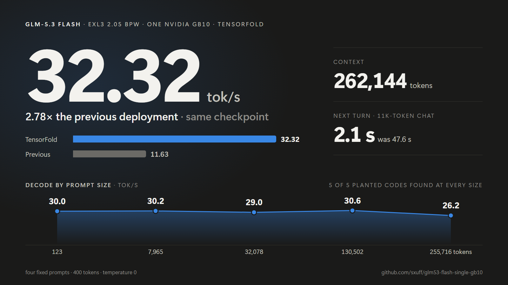

# GLM-5.3 Flash EXL3 on one NVIDIA GB10

GLM-5.3 Flash EXL3 2.05 bpw on one NVIDIA GB10, served by TensorFold 0.6.5 behind an OpenAI-compatible endpoint: 262,144-token context, MTP n=1, prompt state reused between turns.



## Measured

- **32.32 tok/s** decode on four fixed prompts, 400 tokens each, temperature 0. The first deployment here measured 11.63 tok/s on the same prompts (**2.78×**), and ExLlamaV3 1.5.2 measured 28.64 tok/s (+12.9%).
- **26 to 31 tok/s** from a 123-token prompt to a 255,716-token prompt.
- **2.1 s** to the first token of the next turn on an 11,272-token conversation, against 47.6 s when the prompt is filled again. The 1,321-token reply was identical either way.

| Prompt tokens | Decode | Planted codes found |
|---:|---:|---:|
| 123 | 30.0 tok/s | 5 / 5 |
| 7,965 | 30.2 tok/s | 5 / 5 |
| 32,078 | 29.0 tok/s | 5 / 5 |
| 86,068 | 28.5 tok/s | 5 / 5 |
| 130,502 | 30.6 tok/s | 5 / 5 |
| 255,716 | 26.2 tok/s | 5 / 5 |

Each row is one conversation: a document with five planted six-digit codes, then three 512-token turns at temperature 0.

Receipts: [decode against ExLlamaV3](results/glm53-tabby-vs-tensorfold-fixed-work-20261001.json) · [prompt sizes](results/glm53-tensorfold-depth-check-20261004.json) · [prompt-state reuse](results/glm53-tensorfold-cache-equivalence-20261004.json) and [long replies](results/glm53-tensorfold-cache-equivalence-long-replies-20261004.json) · [first deployment](exllamav3/results/glm53-phase0-2026-09-22.md)

These figures were measured on TensorFold 0.5.0. A recheck on 0.6.5, up to 32,078 prompt tokens, came within 2%.

## Recipe

- Checkpoint: `turboderp/GLM-5.3-Flash-exl3`, revision `51058cd551c7e570d87bd32a4adee720edce2349`, 2.05 bpw
- TensorFold: `https://github.com/ashhart/TensorFold`, tag `v0.6.5`, commit `609ca419abecebdc5a059498a613680bd3aa847f`
- Container image: `sha256:1f626b72bd7b20a470dae03ae18039049d50a0d496de20bf818b3b612c8699ee`, built by [`exllamav3/scripts/build-exl152-image.sh`](exllamav3/scripts/build-exl152-image.sh)
- Environment: `EXL3_INT8_GEMV=2`

Two patches, applied in order from a clone of this repository:

```bash
git clone https://github.com/ashhart/TensorFold
cd TensorFold
git checkout 609ca419abecebdc5a059498a613680bd3aa847f
git apply ../patches/01-exl3-single-gpu-port.patch
git apply ../patches/02-serving.patch
```

| Patch | SHA-256 | What it adds |
|---|---|---|
| [`01-exl3-single-gpu-port.patch`](patches/01-exl3-single-gpu-port.patch) | `eba18758e5152c378bc698f7fc0a52ff2c6154fc9e53b57df4c9096743f39ea4` | Loads the packed EXL3 checkpoint on one GPU |
| [`02-serving.patch`](patches/02-serving.patch) | `9137cfdda8d57fa7702179608404c732d3f318dc4266c4fe1ce01d01ab69040d` | The server, the thinking guard, prompt-state reuse, stream keep-alive, and their tests |

`serving/server.py` runs inside the container and `serving/supervisor.py` starts it. Both still import a memory guard, a loader and a service controller from the host they were written on, and those are not published yet. Until they are, the patches give you the serving code but not a launcher.

## Serving profile

- Prompts up to 257,920 tokens, replies up to 16,384.
- Defaults: temperature 0.3, top-p 0.95, min-p 0.05, reasoning effort high, and a new seed for every request that does not send one.
- Thinking is capped at 3,000 tokens. At the cap the server writes a short closing sentence and the close tag, and the answer is then sampled normally. A run of repeated filler ("Hmm, hmm.") ends thinking the same way.
- The next turn of a conversation resumes from the stored prompt state. `"prefix_cache": false` on a request fills the prompt again.
- A streamed request gets an empty chunk every 15 seconds while it waits or fills its prompt. When the client disconnects, the fill stops.
- `GET /metrics` returns Prometheus counters and histograms. `GET /health` returns the running totals as JSON.
- Extra request fields: `thinking_budget`, `thinking_loop`, `prefix_cache`, `seed`, `response_format: {"type": "json_object"}`.

## Limits

- **A new prompt fills at about 245 tok/s**, against 356 tok/s for ExLlamaV3. A fresh 86K-token prompt waits 5.8 minutes for its first token and a 256K one 17 minutes.
- **One request at a time, one conversation stored.** A second conversation replaces the first one's prompt state, so parallel agents fill their whole prompt on every turn.
- **Recall at 2.05 bpw is unreliable.** The model can state a formula wrongly and then keep re-deriving it. The thinking cap bounds that; it does not make the answer right.
- **`max_tokens` below 1,053 is refused** while the thinking guard is on. Send `"thinking_loop": {"enabled": false}` with small caps.
- **A turn that switches thinking off** fills its whole prompt again.
- At depth, only retrieval of planted codes was checked. Each prompt size was run once.

## Checks

`serving/cpu_json.py`, `serving/cpu_prepare.py` and the landing suites under `tests/` run the request handling, prompt fill and state reuse on CPU with the checkpoint's tokenizer: 31, 12 and 146 tests pass on the patched tree. `serving/cache_equivalence.py` and `serving/depth_check.py` are the two live checks behind the numbers above.

## Earlier lanes

- [`exllamav3/`](exllamav3/README.md): TabbyAPI with exllamav3 1.5.2 on the same checkpoint. It has a packaged launcher and fills prompts faster.
- [`gguf/`](gguf/README.md): llama.cpp with a DFlash2 drafter.
- `scripts/`, `systemd/`, `manifests/` and the three older files in `results/`: the first EXL3-K2 recipe.

## License

Repository scripts and documentation are MIT licensed. The patches change TensorFold source, which is Apache-2.0. Model weights retain their upstream terms. The archived DFlash2 drafter weights are CC BY-NC-ND 4.0 and require explicit acceptance before download. See [`NOTICE.md`](NOTICE.md).
