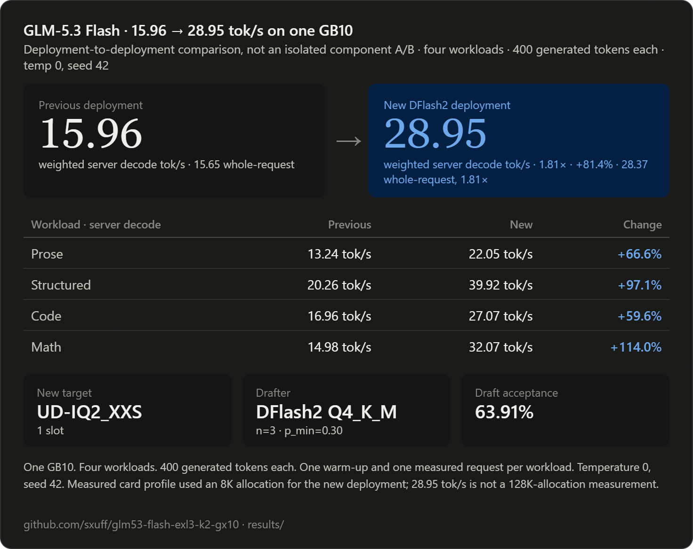

# GLM-5.3 Flash on one NVIDIA GB10

A pinned, reproducible recipe for serving GLM-5.3 Flash with an `UD-IQ2_XXS` target and a `DFlash2 Q4_K_M` drafter on one NVIDIA GB10 system.



## Result

The new DFlash2 deployment nearly doubled throughput over the repository's previous EXL3 deployment on the same GB10.

| Metric | Previous deployment | New DFlash2 deployment | Change |
|---|---:|---:|---:|
| Weighted server decode | 15.96 tok/s | **28.95 tok/s** | **1.81x, +81.37%** |
| Aggregate whole-request | 15.65 tok/s | **28.37 tok/s** | **1.81x, +81.28%** |

Per-workload server decode:

| Workload | Previous | New | Change |
|---|---:|---:|---:|
| Prose | 13.24 tok/s | **22.05 tok/s** | +66.58% |
| Structured | 20.26 tok/s | **39.92 tok/s** | +97.06% |
| Code | 16.96 tok/s | **27.07 tok/s** | +59.63% |
| Math | 14.98 tok/s | **32.07 tok/s** | +113.99% |

The new measured profile used:

- `UD-IQ2_XXS` target
- `DFlash2 Q4_K_M` drafter
- `n_max=3`, `n_min=0`, `p_min=0.30`
- 63.91% draft acceptance across warm-ups and measured requests
- one 8K slot

`Weighted server decode` is total measured completion tokens divided by summed server decode time. `Aggregate whole-request` includes prompt processing and first-token latency.

Deployment-to-deployment comparison, not an isolated component A/B test. The previous deployment used a 64K allocation; the new measured profile used an 8K allocation. The **28.95 tok/s** result is not a 128K-allocation measurement.

## Measurement contract

- Hardware: one NVIDIA GB10
- Workloads: prose, structured output, code, and math
- Generation: 400 tokens per workload
- Repetitions: one warm-up plus one measured request per workload
- Sampling: temperature 0, top-p 1, seed 42, thinking disabled
- Parallel slots: one

The compact comparison receipt is [`gguf/results/deployment-comparison.json`](gguf/results/deployment-comparison.json). The new deployment receipt is [`gguf/results/dflash2-q4km-n3-p030.json`](gguf/results/dflash2-q4km-n3-p030.json). The previous deployment receipt remains at [`results/mtp-k2.json`](results/mtp-k2.json).

## New deployment

### Exact stack

- Target: `unsloth/GLM-5.3-Flash-GGUF`
- Target revision: `2975ab414d30340466d8c51533c6e91f0cca64c1`
- Variant: `UD-IQ2_XXS`
- DFlash2 GGUF revision: `caf6ef0cedd0dc4ac1183c4110266c2e4f58e17c`
- Draft quantization: `Q4_K_M`
- Runtime commit: `d94f44e79aa219d8057e8de21f95360a187ebf41`
- CUDA architecture: SM121

Every downloaded or derived artifact is checksum-pinned. Model weights and runtime binaries are not stored in this repository.

### Build and serve

```bash
cd gguf

python3 scripts/download.py \
  --destination "$HOME/models/GLM-5.3-Flash-UD-IQ2_XXS-2975ab41"

ACCEPT_DFLASH2_NC_LICENSE=1 python3 scripts/download.py \
  --manifest manifests/dflash2.json \
  --destination "$HOME/models/GLM-5.3-Flash-DFlash2"

RUNTIME_MANIFEST=manifests/runtime-dflash2-quantizer.json \
SOURCE_DIR="$PWD/runtime/llama.cpp-dflash2-quantizer" \
BUILD_DIR="$PWD/runtime/llama.cpp-dflash2-quantizer/build-gb10" \
./scripts/build_runtime.sh

BUILD_DIR="$PWD/runtime/llama.cpp-dflash2-quantizer/build-gb10" \
DRAFT_DIR="$HOME/models/GLM-5.3-Flash-DFlash2" \
./scripts/quantize_dflash2.sh

RUNTIME_MANIFEST=manifests/runtime-dflash2.json \
SOURCE_DIR="$PWD/runtime/llama.cpp-dflash2" \
BUILD_DIR="$PWD/runtime/llama.cpp-dflash2/build-gb10" \
./scripts/build_runtime.sh

MODEL_DIR="$HOME/models/GLM-5.3-Flash-UD-IQ2_XXS-2975ab41" \
DRAFT_DIR="$HOME/models/GLM-5.3-Flash-DFlash2" \
./scripts/serve.sh
```

The default launcher reproduces the measured DFlash2 profile: 8K context, one slot, q8 target KV, Q4_K_M drafter, `n=3`, and `p_min=0.30`. Set `MMPROJ` to the verified projector path when image input is required.

Detailed artifact, runtime, benchmark, and verification instructions are in [`gguf/README.md`](gguf/README.md).

## Previous deployment

The previous EXL3 K2 recipe remains available for reproducibility:

- Target revision: `ca0bcdae265f7df1e346c57a2b53b8b8f632ee0b`
- Runtime revision: `878631b6079d2cf9fb80830ef9cb41b43aded098`
- Profile: one 65,536-token slot, native MTP k=2
- Weighted server decode: 15.9612 tok/s

Its setup scripts, manifest, systemd unit, and functional receipts remain under the repository root.

## Repository map

- `gguf/`: new DFlash2 deployment recipe
- `gguf/manifests/`: immutable artifact and runtime pins
- `gguf/results/`: public performance receipts
- `gguf/scripts/`: download, build, verify, serve, benchmark, and analyze
- `results/`: previous deployment receipts
- `scripts/`, `systemd/`: previous EXL3 deployment recipe

## License

Repository scripts and documentation are MIT licensed. Model weights are not redistributed and retain their upstream terms. The DFlash2 drafter weights are CC BY-NC-ND 4.0 and require explicit acceptance before download. See [`NOTICE.md`](NOTICE.md).
